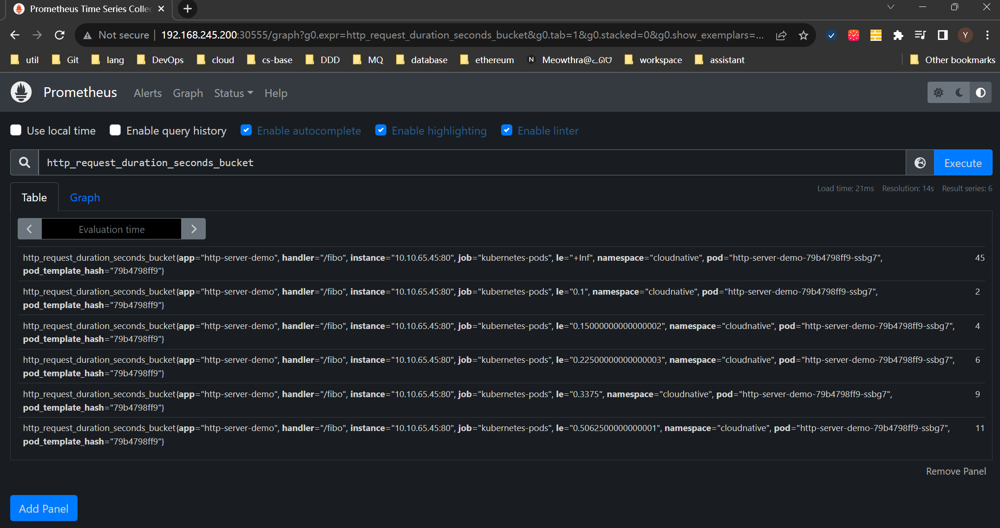
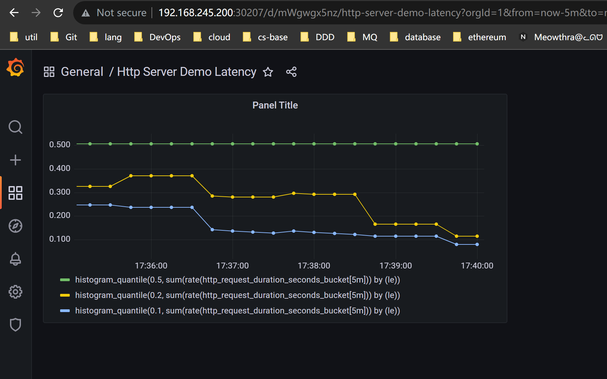

# 模块十作业


## 题目
1. 为 HTTPServer 添加 0-2 秒的随机延时；
2. 为 HTTPServer 项目添加延时 Metric；
3. 将 HTTPServer 部署至测试集群，并完成 Prometheus 配置；
4. 从 Promethus 界面中查询延时指标数据；
5. （可选）创建一个 Grafana Dashboard 展现延时分配情况。


## 答案

1. 为 HTTPServer 添加 0-2 秒的随机延时
    
    在业务方法中追加一个延时的逻辑（`modules/module_10/internal/module10/fibo.go`）：
    ```go
    // create a custom delay from 0 ~ 2 seconds
    func Delay() {
      time.Sleep(time.Millisecond * time.Duration(rand.Intn(2000)))
    }
    ```
    在handler侧，处理具体请求之前调用延时的方法（`modules/module_10/internal/module10/server.go`）:
    ```go
    func (s *Server) fiboHandler(w http.ResponseWriter, r *http.Request) {
      Delay()
      // omit other codes
    }
    ```

2. 为 HTTPServer 项目添加延时 Metric

    创建自定义的Prometheus的http handler wrapper， 完整的实现路径是`modules/module_10/internal/module10/prometheus.go`
    ```go
    func (m *middleware) WrapHandler(handlerName string, handler http.Handler) http.HandlerFunc {
      reg := prometheus.WrapRegistererWith(prometheus.Labels{"handler": handlerName}, m.registry)
      requestDuration := promauto.With(reg).NewHistogramVec(
        prometheus.HistogramOpts{
          Name:    "http_request_duration_seconds",
          Help:    "Tracks the latencies for HTTP requests.",
          Buckets: m.buckets,
        },
        []string{},
      )

      base := promhttp.InstrumentHandlerCounter(
        requestsTotal,
        promhttp.InstrumentHandlerDuration(
          requestDuration,
          http.HandlerFunc(func(writer http.ResponseWriter, r *http.Request) {
            handler.ServeHTTP(writer, r)
          }),
        ),
      )

      return base.ServeHTTP
    }
    ```

    将wrapper包裹业务路径的handler，以及暴露提供metrics信息的服务路径
    ```go
    func (s *Server) register(env string) {
      // metrics wrap 
      s.router.RegisterHandler("/fibo", http.HandlerFunc(prom.WrapHandler("/fibo", http.HandlerFunc(s.fiboHandler))))
      s.router.RegisterHandler("/metrics", promhttp.HandlerFor(
        registry,
        promhttp.HandlerOpts{
          EnableOpenMetrics: true,
        }),
      )
    }
    ```

    启动服务后，查看metrics信息暴露路径是否正常工作。可以看到我们为业务路径`fibo`挂载的自定义的metrics信息以及被成功记录了
    ```bash
    $ curl http://localhost:8080/metrics
    ......
    ......omit other metrics informations......
    ......
    # HELP http_request_duration_seconds Tracks the latencies for HTTP requests.
    # TYPE http_request_duration_seconds histogram
    http_request_duration_seconds_bucket{handler="/fibo",le="0.1"} 2
    http_request_duration_seconds_bucket{handler="/fibo",le="0.15000000000000002"} 4
    http_request_duration_seconds_bucket{handler="/fibo",le="0.22500000000000003"} 6
    http_request_duration_seconds_bucket{handler="/fibo",le="0.3375"} 9
    http_request_duration_seconds_bucket{handler="/fibo",le="0.5062500000000001"} 11
    http_request_duration_seconds_bucket{handler="/fibo",le="+Inf"} 45
    http_request_duration_seconds_sum{handler="/fibo"} 45.794071147
    http_request_duration_seconds_count{handler="/fibo"} 45
    # HELP http_requests_total Tracks the number of HTTP requests.
    # TYPE http_requests_total counter
    http_requests_total{handler="/fibo"} 45
    ......
    ......omit other metrics informations......
    ......
    ```

    当本地调试后确认服务可正常运行后，将服务打包为镜像，并推送的远程仓库中（具体对应Makefile中的build指令）
    ```bash
    $ docker build -t yuki:5000/http-server-demo:v0.0.4 .
    $ docker push yuki:5000/http-server-demo:v0.0.4
    ```

3. 将 HTTPServer 部署至测试集群，并完成 Prometheus 配置；
    
    首先在集群中部署Prometheus相关套件

    首先确保helm成功安装
    ```bash
    $ which helm
    /usr/local/bin/helm
    ```
    为helm其配置grafana的仓库
    ```bash
    $ helm repo add grafana https://grafana.github.io/helm-charts
    ```
    下载并修改loki stack的helm chart中的部分内容，并进行loki stack的安装
    ```bash
    $ helm pull grafana/loki-stack
    $ tar -xvf loki-stack-*.tgz
    $ cd loki-stack && grep -rl "rbac.authorization.k8s.io/v1beta1" . | xargs sed -i 's/rbac.authorization.k8s.io\/v1beta1/rbac.authorization.k8s.io\/v1/g'
    $ cd ..
    $ helm upgrade --install loki ./loki-stack --set grafana.enabled=true,prometheus.enabled=true,prometheus.alertmanager.persistentVolume.enabled=false,prometheus.server.persistentVolume.enabled=false
    ```
    查看loki stack是否安装成功
    ```bash
    $ kubectl get pods
    NAME                                            READY   STATUS    RESTARTS        AGE
    loki-0                                          1/1     Running   0               4h25m
    loki-grafana-746db44b67-kmrzd                   2/2     Running   0               4h25m
    loki-kube-state-metrics-7448968777-pvzn9        1/1     Running   0               4h25m
    loki-prometheus-alertmanager-7c5d7d5849-288dr   2/2     Running   0               4h25m
    loki-prometheus-node-exporter-p2ntt             1/1     Running   0               4h25m
    loki-prometheus-node-exporter-rpmkz             1/1     Running   0               4h25m
    loki-prometheus-pushgateway-dcb478496-cbtwz     1/1     Running   0               4h25m
    loki-prometheus-server-7cf7dcf794-vmn8c         2/2     Running   0               4h25m
    loki-promtail-6bwbd                             1/1     Running   0               4h25m
    loki-promtail-fzj7t                             1/1     Running   0               4h25m
    loki-promtail-zmrxn                             1/1     Running   0               4h25m
    ```
    可以看到。loki stack相关的组件，如Prometheus，grafana已经被安装在default的namespace下面了

    下面修改http server的配置，具体配置放置于`modules/module_10/manifest`中，核心配置是在deployment中为容器的template的metadata中写入Prometheus相关的annotations，如下：
    ```yaml
    apiVersion: apps/v1
    kind: Deployment
    metadata:
      name: http-server-demo
      namespace: cloudnative
    spec:
      replicas: 1
      selector:
        matchLabels:
          app: http-server-demo
      template:
        metadata:
          labels:
            app: http-server-demo
          annotations:
            prometheus.io/port: server-port
            prometheus.io/scrape: "true"
        spec:
    // omit the contents of spec
    // ...
    ```
    然后将服务部署到集群中
    ```bash
    $ kubectl apply -f ./manifest/
    ```
    查看服务是否正常运行：
    ```bash
    $ kubectl get all --namespace cloudnative
    NAME                                    READY   STATUS    RESTARTS   AGE
    pod/http-server-demo-79b4798ff9-ssbg7   1/1     Running   0          138m

    NAME                       TYPE       CLUSTER-IP     EXTERNAL-IP   PORT(S)        AGE
    service/http-server-demo   NodePort   10.10.127.72   <none>        80:31112/TCP   4h13m

    NAME                               READY   UP-TO-DATE   AVAILABLE   AGE
    deployment.apps/http-server-demo   1/1     1            1           4h13m

    NAME                                          DESIRED   CURRENT   READY   AGE
    replicaset.apps/http-server-demo-79b4798ff9   1         1       0       4h
    ```
    可以看到，对应的资源均已被正确创建与正常运行

4. 从 Promethus 界面中查询延时指标数据；

    为了方便在本地访问Prometheus的Dashbord，将集群中的Service `loki-prometheus-server` 设置为NodePort类型服务
    ```bash
    $ kubectl edit svc loki-prometheus-server 
    $ kubectl get svc loki-prometheus-server 
    NAME                     TYPE       CLUSTER-IP      EXTERNAL-IP   PORT(S)        AGE
    loki-prometheus-server   NodePort   10.10.196.104   <none>        80:30555/TCP   4h38m
    ```
    此时可以通过宿主机浏览器，访问虚拟机的ip + NodePort端口访问Prometheus的dashbord

    查询我们在http server自定义的metrics信息`http_request_duration_seconds`，如下图所示
    

5. 创建一个 Grafana Dashboard 展现延时分配情况。

    为了方便在本地访问Grafana的Dashbord，将集群中的Service `loki-grafana` 设置为NodePort类型服务
    ```bash
    $ kubectl edit svc loki-grafana
    $ kubectl get svc loki-grafana
    NAME           TYPE       CLUSTER-IP    EXTERNAL-IP   PORT(S)        AGE
    loki-grafana   NodePort   10.10.84.22   <none>        80:30207/TCP   4h45m
    ```

    配置一个Grafana Dashboard，具体配置的内容在`module_10/misc`，核心配置如下
    ```json
    [
      {
          "exemplar": true,
          "expr": "histogram_quantile(0.5, sum(rate(http_request_duration_seconds_bucket[5m])) by (le))",
          "interval": "",
          "legendFormat": "",
          "refId": "A"
      },
      {
          "exemplar": true,
          "expr": "histogram_quantile(0.2, sum(rate(http_request_duration_seconds_bucket[5m])) by (le))",
          "hide": false,
          "interval": "",
          "legendFormat": "",
          "refId": "B"
      },
      {
          "exemplar": true,
          "expr": "histogram_quantile(0.1, sum(rate(http_request_duration_seconds_bucket[5m])) by (le))",
          "hide": false,
          "interval": "",
          "legendFormat": "",
          "refId": "C"
      }
    ]
    ```
    进入Grafana导入该配置后，进行若干次业务接口的请求后，查看此时Panel的内容：
    