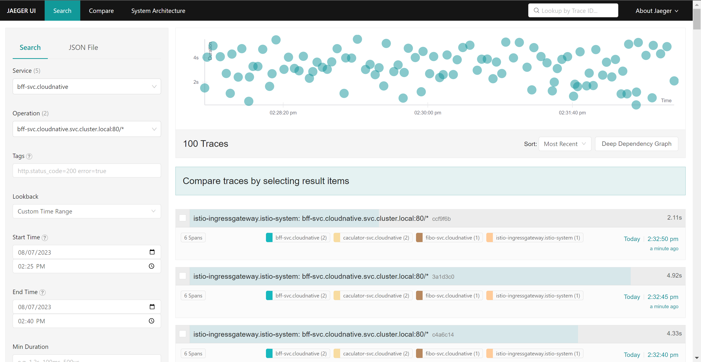
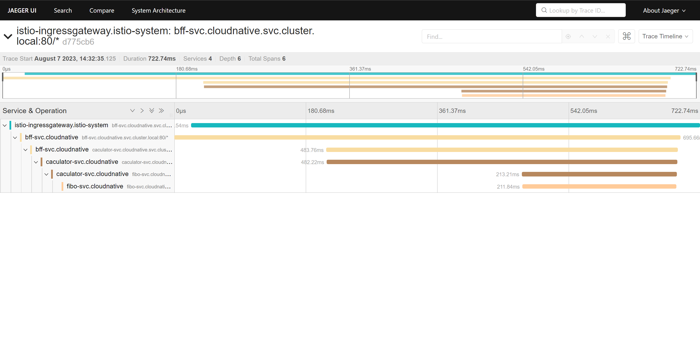

# 模块十二作业


## 题目
1. 把我们的 httpserver 服务以 Istio Ingress Gateway 的形式发布出来。以下是你需要考虑的几点：

    1. 如何实现安全保证；
    2. 七层路由规则；
    3. 考虑 open tracing 的接入。


## 答案

1. 在集群中安装istio，安装脚本放置于`/istio/installation`
    ```bash
    curl -L https://istio.io/downloadIstio | sh -
    cd istio-*
    cp bin/istioctl /usr/local/bin
    istioctl install --set profile=demo -y
    ```

    查看是否安装成功：
    ```bash
    $ which istioctl
    /usr/local/bin/istioctl

    $ kubectl get all -n istio-system
    NAME                                        READY   STATUS    RESTARTS   AGE
    pod/istio-egressgateway-9d945b6fc-qtf7q     1/1     Running   0          139m
    pod/istio-ingressgateway-67c77cfc47-jznz9   1/1     Running   0          139m
    pod/istiod-7c65799ccc-xx259                 1/1     Running   0          140m

    NAME                           TYPE           CLUSTER-IP      EXTERNAL-IP   PORT(S)                                                                      AGE
    service/istio-egressgateway    ClusterIP      10.10.196.91    <none>        80/TCP,443/TCP                                                               139m
    service/istio-ingressgateway   LoadBalancer   10.10.227.194   <pending>     15021:32494/TCP,80:30183/TCP,443:30218/TCP,31400:32530/TCP,15443:32514/TCP   139m
    service/istiod                 ClusterIP      10.10.199.150   <none>        15010/TCP,15012/TCP,443/TCP,15014/TCP                                        140m

    NAME                                   READY   UP-TO-DATE   AVAILABLE   AGE
    deployment.apps/istio-egressgateway    1/1     1            1           139m
    deployment.apps/istio-ingressgateway   1/1     1            1           139m
    deployment.apps/istiod                 1/1     1            1           140m

    NAME                                              DESIRED   CURRENT   READY   AGE
    replicaset.apps/istio-egressgateway-9d945b6fc     1         1         1       139m
    replicaset.apps/istio-ingressgateway-67c77cfc47   1         1         1       139m
    replicaset.apps/istiod-7c65799ccc                 1         1         1       140m
    ```

    可以看到istio在集群中的相关组件都已经启动成功

2. 以Istio Ingress Gateway的形式发布http服务

    * 服务改造

        首先对原来的服务进行改造，拆分为bff（位于`/bff`），caculator（位于`/caculator`）以及fibo（位于`/fibo`）三个服务，调用关系为，外部调用bff服务，bff服务调用caculator服务，caculator服务调用fibo服务，fibo服务里实现计算Fibonacci数列的业务逻辑

        核心的改造内容是，在envoy中注入的http请求头在每个服务的调用的请求头中进行传递，这里使用context来实现这一传递过程，具体如下:
        在handler中将原始请求头注入context
        ```go
        type httpheader string

        const (
            headerKey httpheader = "headers"
        )

        func (s *Server) fiboHandler(w http.ResponseWriter, r *http.Request) {
            ctx := context.WithValue(context.Background(), headerKey, r.Header)
            // omit other logics
        }
        ```
        在请求扇出的时候，将请求头的内容重新注入新的请求中，如下：
        ```go
        func (f *Caculator) Fibo(ctx context.Context, n int) (int, error) {
            path, _ := url.JoinPath(f.baseUrl, "fibo")
            path += ("?n=" + strconv.Itoa(n))
            req, _ := http.NewRequest(http.MethodGet, path, nil)
            req.Header = ctx.Value(headerKey).(http.Header)
            res, _ := f.client.Do(req)
            // omit other error handle and other logics
        }
        ```

    * namespace改造

        为了让envoy的sidecar容器可以自动注入到业务pod中，需要对namespace进行改造，如下：
        ```yaml
        apiVersion: v1
        kind: Namespace
        metadata:
        creationTimestamp: "2023-07-29T07:35:41Z"
        labels:
            kubernetes.io/metadata.name: cloudnative
            istio-injection: enabled
        name: cloudnative
        ```
        为namespace打上`istio-injection`标签，后续在该namespace上发布的Pod都会自动注入envoy

    * 证书生成

        假设对外暴露的域名是`cloudnative.io`，为该域名生成证书：
        ```bash
        $ openssl genrsa -out $(PWD)/ca/cloudnative.io.key 4096
	    $ openssl req -new -x509 -days 3650 \
    	-subj "/C=GB/L=China/O=grpc-server/CN=cloudnative.io" \
		-addext "subjectAltName = DNS:cloudnative" \
    	-key $(PWD)/ca/cloudnative.io.key -out $(PWD)/ca/cloudnative.io.crt
        ```
        生成的证书位于`/ca`下
        然后将证书发布到集群的namespace `istio-system`之下：
        ```bash
        $ kubectl create -n istio-system secret tls cloudnative-credential --key=./module12/ca/cloudnative.io.key --cert=./module12/ca/cloudnative.io.crt
        $ kubectl get secret -n istio-system -owide
        NAME                     TYPE                DATA   AGE
        cloudnative-credential   kubernetes.io/tls   2      99m
        istio-ca-secret          istio.io/ca-root    5      163m
        ```

    * 服务发布

        三个服务的发布文件均放置在`/manifest`下，均以`ClusterIP`的形式暴露业务Pod的服务。由于bff需要以Istio Ingress Gateway的形式对外暴露，因此需要额外配置`VirtualService`和`Gateway`对象
        VirtualService(`/manifest/bff/vs.yaml`)如下: 
        ```yaml
        apiVersion: networking.istio.io/v1beta1
        kind: VirtualService
        metadata:
        name: bff-svc
        namespace: cloudnative
        spec:
        gateways:
            - bff-svc
        hosts:
            - cloudnative.io
        http:
            - match:
                - port: 443
            route:
                - destination:
                    host: bff-svc.cloudnative.svc.cluster.local
                    port:
                    number: 80
        ```


        Gateway(`/manifest/bff/gw.yaml`)如下：
        ```yaml
        apiVersion: networking.istio.io/v1beta1
        kind: Gateway
        metadata:
        name: bff-svc
        namespace: cloudnative
        spec:
        selector:
            istio: ingressgateway
        servers:
            - hosts:
                - cloudnative.io
            port:
                name:  bff-svc
                number: 443
                protocol: HTTPS
            tls:
                mode: SIMPLE
                credentialName: cloudnative-credential
        ```
        在gateway中指定对外暴露的是https服务，并为其指定的证书为我们刚刚在证书生成步骤导入的证书`cloudnative-credential`

    * 查看ingressgateway
        
        查看`istio-ingressgateway`集群内的IP地址，并修改本机的`/etc/hosts`文件以便以域名的方式访问服务
        ```bash
        $ kubectl get svc -n istio-system
        NAME                   TYPE           CLUSTER-IP      EXTERNAL-IP   PORT(S)                                                                      AGE
        istio-egressgateway    ClusterIP      10.10.196.91    <none>        80/TCP,443/TCP                                                               167m
        istio-ingressgateway   LoadBalancer   10.10.227.194   <pending>     15021:32494/TCP,80:30183/TCP,443:30218/TCP,31400:32530/TCP,15443:32514/TCP   167m
        istiod                 ClusterIP      10.10.199.150   <none>        15010/TCP,15012/TCP,443/TCP,15014/TCP                                        168m
        ```
        可以看到`istio-ingressgateway`集群内IP是10.10.227.194，然后进行对`hosts`文件追加一条规则`10.10.227.194 cloudnative.io`
        
        此时我们可以通过域名访问部署的服务了
        ```bash
        $ curl -k https://cloudnative.io/fibo?n=10
        {"result": 55}
        ```

3. open telemetry的接入

    * 首先为集群安装上Jaeger组件
        ```bash
        $ kubectl apply -f ./manifest/jaeger.yaml
        ```

        查看组件的状态：
        ```bash
        $ kubectl get all -n istio-system
        NAME                                        READY   STATUS    RESTARTS   AGE
        pod/istio-egressgateway-9d945b6fc-qtf7q     1/1     Running   0          139m
        pod/istio-ingressgateway-67c77cfc47-jznz9   1/1     Running   0          139m
        pod/istiod-7c65799ccc-xx259                 1/1     Running   0          140m
        pod/jaeger-5b994f64f4-d6dbb                 1/1     Running   0          53m

        NAME                           TYPE           CLUSTER-IP      EXTERNAL-IP   PORT(S)                                                                      AGE
        service/istio-egressgateway    ClusterIP      10.10.196.91    <none>        80/TCP,443/TCP                                                               139m
        service/istio-ingressgateway   LoadBalancer   10.10.227.194   <pending>     15021:32494/TCP,80:30183/TCP,443:30218/TCP,31400:32530/TCP,15443:32514/TCP   139m
        service/istiod                 ClusterIP      10.10.199.150   <none>        15010/TCP,15012/TCP,443/TCP,15014/TCP                                        140m
        service/jaeger-collector       ClusterIP      10.10.144.242   <none>        14268/TCP,14250/TCP,9411/TCP                                                 53m
        service/tracing                ClusterIP      10.10.171.200   <none>        80/TCP,16685/TCP                                                             53m
        service/zipkin                 ClusterIP      10.10.157.212   <none>        9411/TCP                                                                     53m

        NAME                                   READY   UP-TO-DATE   AVAILABLE   AGE
        deployment.apps/istio-egressgateway    1/1     1            1           139m
        deployment.apps/istio-ingressgateway   1/1     1            1           139m
        deployment.apps/istiod                 1/1     1            1           140m
        deployment.apps/jaeger                 1/1     1            1           53m

        NAME                                              DESIRED   CURRENT   READY   AGE
        replicaset.apps/istio-egressgateway-9d945b6fc     1         1         1       139m
        replicaset.apps/istio-ingressgateway-67c77cfc47   1         1         1       139m
        replicaset.apps/istiod-7c65799ccc                 1         1         1       140m
        replicaset.apps/jaeger-5b994f64f4                 1         1         1       53m
        ```
        我们看到集群中的Jaeger组件均已经就绪了

    * 配置采样率
        我们需要调整Istio配置中的采样率：
        ```yaml
        apiVersion: v1
        data:
            mesh: |-
                accessLogFile: /dev/stdout
                defaultConfig:
                discoveryAddress: istiod.istio-system.svc:15012
                proxyMetadata: {}
                tracing:
                    sampling: 100.0
        ```
        具体需要更新的是`istio-system`下的configmap中的`istio`配置中，在tracing中加入`sampling: 100.0`，代表追踪所有的请求

    * 批量发起请求
        
        我们使用一段脚本来向刚刚部署的服务发起100次请求，每次输入一个0~40之间的一个随机数计算其Fibonacci数列的值，脚本位于`/misc/request.sh`
        ```bash
        $ sh ./misc/request.sh
        Sending request 1: https://cloudnative.io/fibo?n=31
        {"result": 1346269}Sending request 2: https://cloudnative.io/fibo?n=7
        {"result": 13}Sending request 3: https://cloudnative.io/fibo?n=14
        {"result": 377}Sending request 4: https://cloudnative.io/fibo?n=3
        {"result": 2}Sending request 5: https://cloudnative.io/fibo?n=39
        # omit rest of results
        ```

    * 查看Jaeger记录的链路追踪

        打开Jaeger的dashboard
        ```bash
        $ istioctl dashboard jaeger
        http://localhost:16686
        ```

        打开后查询`bff-svc.cloudnative`相关的追踪信息，如下所示
        

        打开其中的一个链路详情，如下所示
        

        可以看到我们可以很清晰第看到三个服务之间的调用关系以及在每一个环节中所耗费的时间，对于线上服务的问题排除非常有用